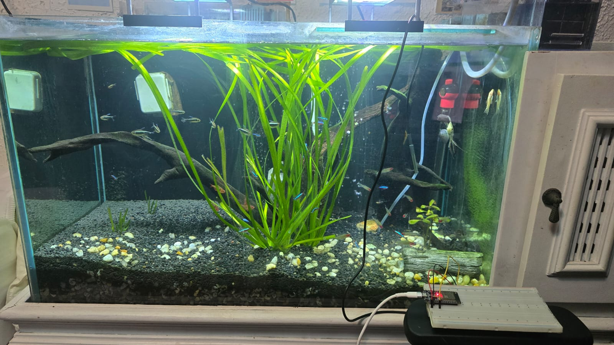
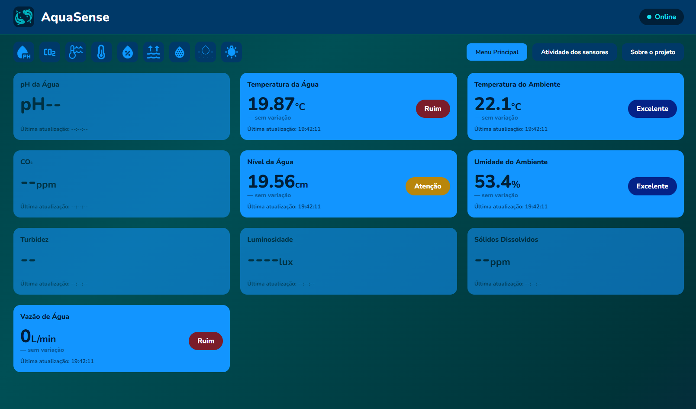
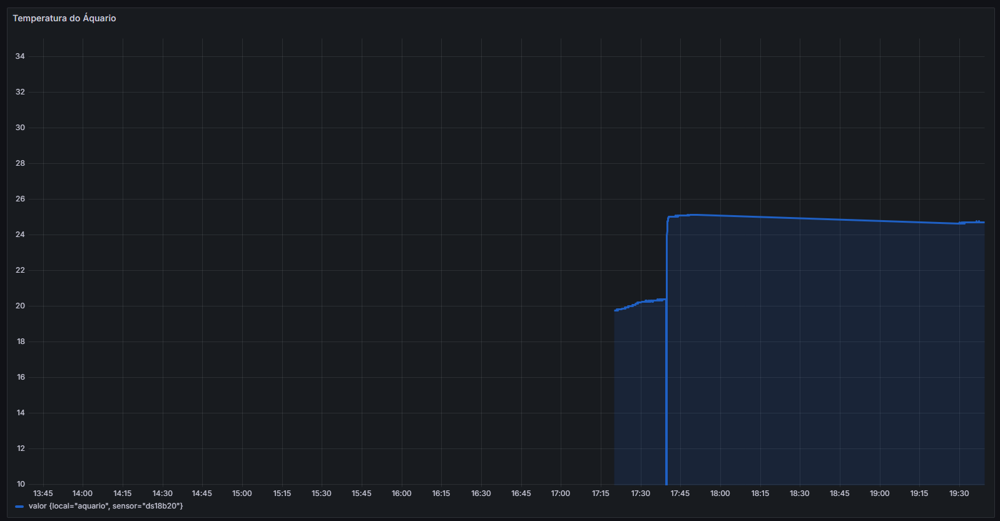

# 🐠 AquaSense

ESP32-based IoT system for aquarium monitoring and automation.

## 📋 Features (planned)
- [ ] Temperature monitoring
- [ ] pH monitoring
- [ ] Luminosity monitoring
- [ ] Turbidity monitoring
- [ ] Water level monitoring
- [ ] Automatic fish feeder
- [ ] Real-time web dashboard
- [ ] Telegram alerts

## 🛠️ Technologies
- ESP32 (C++ with Arduino Framework)
- PlatformIO (development environment)
- MQTT protocol
- Node.js (backend)
- InfluxDB (time-series database)
- Grafana (dashboard)
- Wokwi (circuit simulation)
- Telegram Bot API (alerts)

## 🗺️ Roadmap
🔧 Project under construction...

## 📸 The Aquarium

## 📊 Dashboard

 

## 👨‍💻 Author
**Thauan De Lima** — Computer Engineering student at FIAP

## 📅 Development Log
- **11/06/2026** — Project started, repository created, folder structure defined
- **12/06/2026** — First firmware running on ESP32, DS18B20 temperature sensor, WiFi connection, MQTT publishing to HiveMQ Cloud
- **13/06/2026** — Node.js backend with MQTT subscriber and REST API; removed node_modules from repository; fixed .gitignore
- **16/06/2026** — Frontend dashboard with real-time temperature display and Deep Blue Theme; updated fetch URL for local network access
- **18/06/2026** — Physical DS18B20 sensor connected and tested; first real aquarium temperature reading (24.81°C) displayed on dashboard
- **30/06/2026** — Migrated firmware to ESP32-S3 UNO board (S3-N16R8); added DHT22 sensor for ambient temperature and humidity monitoring; updated backend to subscribe and persist all three MQTT topics (temperatura, temperatura_ambiente, umidade) to InfluxDB; added Grafana panels for ambient temperature and humidity
- **02/07/2026** — Added HC-SR04 ultrasonic sensor for water level monitoring with voltage divider circuit; updated backend and frontend to display water temperature, ambient temperature, humidity, and water level in real-time
- **10/07/2026** — Redesigned frontend dashboard with new visual identity (Figma mockup, color palette, Nunito typeface); added animated gradient background; implemented health status classification (Excelente/Bom/Atenção/Ruim) per sensor based on aquarium species requirements; added delta indicators showing variation since last reading
- **13/07/2026** — Added custom icons for main logo and sensor navigation tabs; reorganized dashboard cards layout; restructured project folder to separate image assets into dedicated icons/ directory
- **14/07/2026** — Programmed water flow sensor (ZJ-S201) firmware using interrupt-based pulse counting; implemented voltage divider circuit for safe 5V-to-3.3V signal conversion; calculated flow rate using manufacturer's K-factor
- **15/07/2026** — Integrated water flow sensor into backend (MQTT subscription, InfluxDB persistence, status API) and frontend (dashboard card with real-time value, delta, and health classification); calibrated pump flow rate against recommended aquarium filtration standards